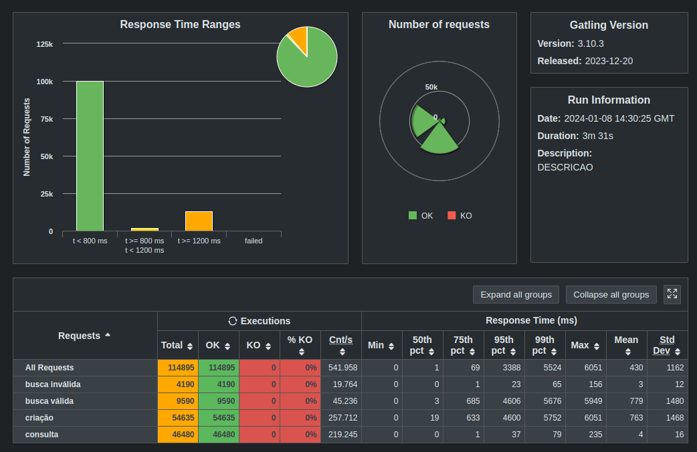
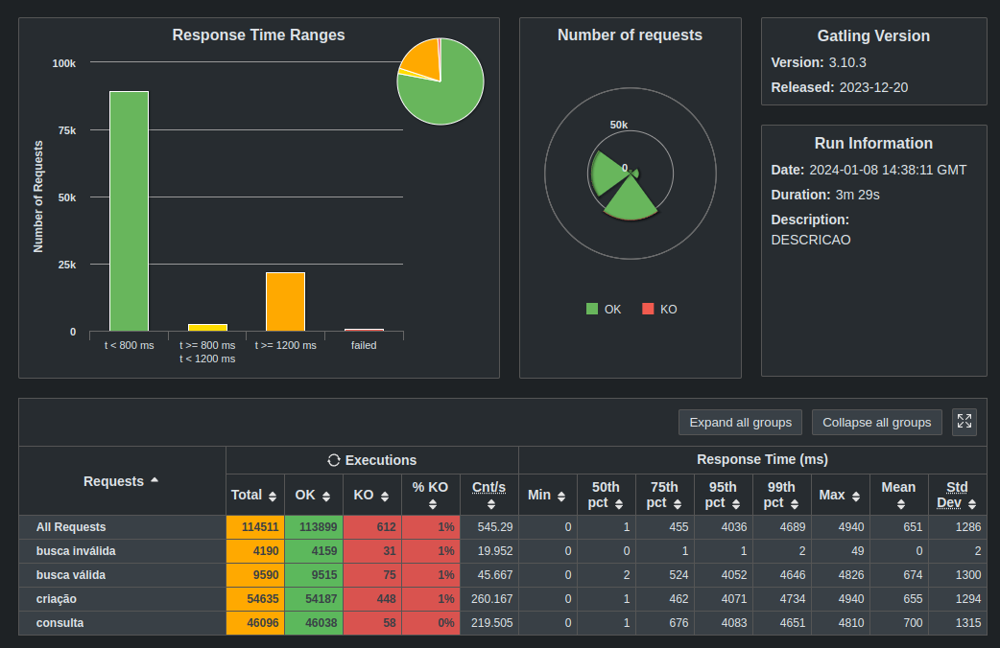

### Rinha Backend - Golang version

## Results

- With cache (simple in memory cache that cannot be used in production)


Records in database: 46.480

- Without cache


Records in database: 46.096

## Missing
- Unit testings
- Integration tests

## Goals
- Learn Golang
- Learn how to use Golang with Docker
- Learn how to use Golang with Postgres
- Learn how to use Golang with Swagger
- Learn Unit tests using Golang
- Learn gRPC

## How to run
- Install [Golang](https://golang.org/doc/install)
- Install [Docker](https://docs.docker.com/engine/install/)
- Install [Docker Compose](https://docs.docker.com/compose/install/)
- Run `docker-compose up -d`

## (Linux Only) How to run with network_mode: host

```bash
docker compose -f docker-compose-mode-host.yaml up -d
```

## How to test
- Run `go test ./...`

## How to use
- Run `go run main.go`
- Open [http://localhost:8080](http://localhost:8080)
- Swagger: [http://localhost:8080/swagger/index.html](http://localhost:8080/swagger/index.html)